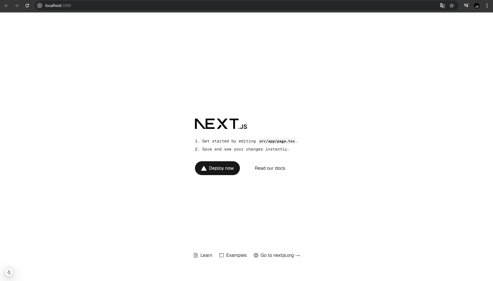

This is a [Next.js](https://nextjs.org) project bootstrapped with [`create-next-app`](https://nextjs.org/docs/app/api-reference/cli/create-next-app).

## Getting Started

First, run the development server:

```bash
npm run dev
# or
yarn dev
# or
pnpm dev
# or
bun dev
```

Open [http://localhost:3000](http://localhost:3000) with your browser to see the result.

## Laporan Praktikum

|       | Pemrograman Berbasis Framework  |
| ----- | ------------------------------- |
| NIM   | 2241720099                      |
| Nama  | Muhammad Iqbal Makmur Al-Muniri |
| Kelas | TI-3C                           |

### Praktikum 1

1. Jelaskan kegunaan masing-masing dari Git, VS Code dan NodeJS yang telah anda install pada sesi praktikum ini!

   Jawab:

   - Git berfungsi sebagai pelacak perubahan kode yang berada di vscode. Setelah mendeteksi adanya perubahan kode program di vscode, perubahan dapat di update ke github dengan menggunakan Git.
   - VS Code berfungsi sebagai code editor, atau tempat dimana kita membuat kode program untuk dijalankan
   - Node.js berfungsi sebagai eksekusi javascript di luar browser yang bertujuan untuk membuat aplikasi backend. ini adalah npm yang dijalankan untuk mengelola library dan depedensi project

2. Buktikan dengan screenshoot yang menunjukkan bahwa masing-masing tools tersebut telah berhasil terinstall di perangkat anda!

   Jawab:
   

### Praktikum 2 : Membuat Proyek Pertama React Menggunakan Next.js

1. Pada Langkah ke-2, setelah membuat proyek baru menggunakan Next.js, terdapat beberapa istilah yang muncul. Jelaskan istilah tersebut, TypeScript, ESLint, Tailwind CSS, App Router, Import alias, App router, dan Turbopack!

   Jawab:

   - TypeScript adalah bahasa pemrograman yang merupakan superset dari JavaScript dan memiliki fitur static typing. Berfungsi untuk membantu menangkap bug lebih awal

   - Eslint berfungsi untuk mendeteksi dan memperbaiki kesalahan sintaks, membuat kode lebih rapi, mudah dibaca, dan bebas dari bug yang tidak perlu

   - Tailwind CSS adalah framework CSS yang memungkinkan styling langsung dalam HTML atau JSX tanpa perlu menulis banyak CSS. Pada dasarnya Tailwind berfungsi untuk pengembangan frontend CSS dan mengurangi menulis CSS secara manual

   - App Router adalah sistem routing baru di Next.js yang berbasis pada folder app/ dan menggunakan Server Components secara default. Berfungsi untuk data fetching yang lebih efisien

   - Import Alias adalah cara untuk mengganti path panjang dengan alias yang lebih pendek dalam proyek

   - Turbopack adalah bundler baru untuk Next.js yang lebih cepat dibanding Webpack dan Vite. Berfungsi untuk mengurangi waktu build serta waktu refresh selama development

2. Apa saja kegunaan folder dan file yang ada pada struktur proyek React yang tampil pada gambar pada tahap percobaan ke-3!

   Jawab:

   - node_modules/ Berisi library yang diinstal (jangan diubah)
   - public/ Menyimpan file statis seperti index.html, favicon, dll.
   - src/ Berisi semua kode React utama
   - components/ Menyimpan komponen UI yang bisa digunakan ulang
   - assets/ Menyimpan gambar, font, dan file statis lainnya
   - utils/ Menyimpan fungsi helper seperti API calls
   - hooks/ Menyimpan custom hooks untuk React
   - index.js Entry point utama React
   - App.js Komponen utama aplikasi
   - .gitignore Menentukan file yang tidak boleh diunggah ke GitHub
   - package.json Manajemen dependensi proyek

3. Buktikan dengan screenshoot yang menunjukkan bahwa tahapan percobaan di atas telah berhasil anda lakukan!

   Jawab:

   

### Praktikum 3 : Menambahkan Komponen React (Button)

1. Buktikan dengan screenshot yang menunjukkan bahwa tahapan percobaan di atas telah berhasil anda lakukan!

   Jawab:

   

### Praktikum 4 : Menulis Markup dengan JSX

1. Untuk apakah kegunaan sintaks user.imageUrl?

   Jawab:

   Fungsi sintaks user.imageUrl, adalah untuk memanggil const user -> imageUrl yang sudah di deklarasikan di awal kode program. program mengeksekusi const user terlebih dahulu, lalu selanjutnya eksekusi imageUrl yang berada di dalam const user.

2. Buktikan dengan screenshot yang menunjukkan bahwa tahapan percobaan di atas telah berhasil Anda lakukan!

   Jawab:

   
